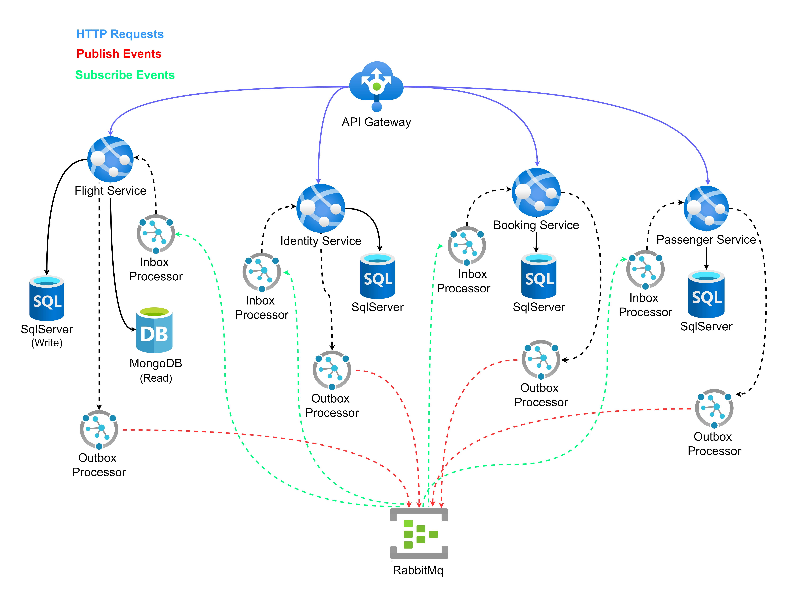

# Booking-Microservices-Sample

Booking Microservices is a Sample application for booking ticket. This application based on different software architecture and technologies like .Net Core, CQRS, DDD, Vertical Slice Architecture, Docker, kubernetes, tye, MassTransit, RabbitMQ, gRPC, yarp reverse proxy, Identity Server, Redis, SqlServer, Entity Framework Core, Event Sourcing and different level of testing.

# Table of Contents

- [The Goals of This Project](#the-goals-of-this-project)
- [Technologies - Libraries](#technologies---libraries)
- [The Domain and Bounded Context - Service Boundary](#the-domain-and-bounded-context---service-boundary)
- [Structure of Project](#structure-of-project)
- [Prerequisites](#prerequisites)
- [How to Run](#how-to-run)
  - [Docker Compose](#docker-compose)
  - [Kubernetes](#kubernetes)

## The Goals of This Project

- Microservices based on `Domain Driven Design (DDD)` implementation.
- Correct `separation of bounded contexts` for each microservice.
- Communication between bounded contexts through asynchronous `MessageBus` and `events`.
- Communication internally between our microservices with `gRPC` synchronously.
- Simple `CQRS` implementation and Event Driven Architecture with using `SqlServer` in `write side` and `MongoDB` in `read side`. I use an `internal processor` for syncing `read side` and `write side` without event sourcing.
- Using `event store` to store all historical state of aggregate. (Booking-Microservice)
- Using `Inbox Pattern` for guaranty message Idempotency for receiver microservice and `Exactly-once Delivery pattern` and using `Outbox Pattern` for ensuring about any message `lost and At-Least one Delivery` rule.
- Implementing various types of testing like `Unit Testing`, `Integration Testing`.
- Using `Health Check` for reporting the health of app infrastructure components.
- Using `Best Practice` and `New Technologies` and `Design Patterns`.
- Using `Docker-Compose` and `Kubernetes` for our deployment mechanism.

## Technologies - Libraries

- ✔️ **[`.NET 6`](https://dotnet.microsoft.com/download)** - .NET Framework and .NET Core, including ASP.NET and ASP.NET Core
- ✔️ **[`MVC Versioning API`](https://github.com/microsoft/aspnet-api-versioning)** - Set of libraries which add service API versioning to ASP.NET Web API, OData with ASP.NET Web API, and ASP.NET Core
- ✔️ **[`EF Core`](https://github.com/dotnet/efcore)** - Modern object-database mapper for .NET. It supports LINQ queries, change tracking, updates, and schema migrations
- ✔️ **[`Masstransit`](https://github.com/MassTransit/MassTransit)** - Distributed Application Framework for .NET.
- ✔️ **[`MediatR`]()** - Simple, unambitious mediator implementation in .NET.
- ✔️ **[`FluentValidation`](https://github.com/FluentValidation/FluentValidation)** - Popular .NET validation library for building strongly-typed validation rules
- ✔️ **[`Swagger & Swagger UI`](https://github.com/domaindrivendev/Swashbuckle.AspNetCore)** - Swagger tools for documenting API's built on ASP.NET Core
- ✔️ **[`Serilog`](https://github.com/serilog/serilog)** - Simple .NET logging with fully-structured events
- ✔️ **[`Polly`](https://github.com/App-vNext/Polly)** - Polly is a .NET resilience and transient-fault-handling library that allows developers to express policies such as Retry, Circuit Breaker, Timeout, Bulkhead Isolation, and Fallback in a fluent and thread-safe manner
- ✔️ **[`Scrutor`](https://github.com/khellang/Scrutor)** - Assembly scanning and decoration extensions for Microsoft.Extensions.DependencyInjection
- ✔️ **[`Opentelemetry-dotnet`](https://github.com/open-telemetry/opentelemetry-dotnet)** - The OpenTelemetry .NET Client
- ✔️ **[`DuendeSoftware IdentityServer`](https://github.com/DuendeSoftware/IdentityServer)** - The most flexible and standards-compliant OpenID Connect and OAuth 2.x framework for ASP.NET Core
- ✔️ **[`EasyCaching`](https://github.com/dotnetcore/EasyCaching)** - Open source caching library that contains basic usages and some advanced usages of caching which can help us to handle caching more easier.
- ✔️ **[`Mapster`](https://github.com/MapsterMapper/Mapster)** - Convention-based object-object mapper in .NET.
- ✔️ **[`Hellang.Middleware.ProblemDetails`](https://github.com/khellang/Middleware/tree/master/src/ProblemDetails)** - A middleware for handling exception in .Net Core
- ✔️ **[`IdGen`](https://github.com/RobThree/IdGen)** - Twitter Snowflake-alike ID generator for .Net
- ✔️ **[`Yarp`](https://github.com/microsoft/reverse-proxy)** - Reverse proxy toolkit for building fast proxy servers in .NET
- ✔️ **[`Tye`](https://github.com/dotnet/tye)** - Developer tool that makes developing, testing, and deploying microservices and distributed applications easier
- ✔️ **[`MagicOnion`](https://github.com/Cysharp/MagicOnion)** - gRPC based HTTP/2 RPC Streaming Framework for .NET, .NET Core and Unity.
- ✔️ **[`EventStore`](https://github.com/EventStore/EventStore)** - The open-source, functional database with Complex Event Processing.
- ✔️ **[`MongoDB.Driver`](https://github.com/mongodb/mongo-csharp-driver)** - .NET Driver for MongoDB.
- ✔️ **[`xUnit.net`](https://github.com/xunit/xunit)** - A free, open source, community-focused unit testing tool for the .NET Framework.
- ✔️ **[`Respawn`](https://github.com/jbogard/Respawn)** - Respawn is a small utility to help in resetting test databases to a clean state.
- ✔️ **[`Mongo2Go`](https://github.com/Mongo2Go/Mongo2Go)** - Providing multiple, temporary and isolated MongoDB databases for unit tests (or to be precise: integration tests).

## The Domain And Bounded Context - Service Boundary

- `Identity Service`: The Identity Service is a bounded context for the authentication and authorization of users using [Identity Server](https://github.com/DuendeSoftware/IdentityServer). This service is responsible for creating new users and their corresponding roles and permissions using [.Net Core Identity](https://docs.microsoft.com/en-us/aspnet/core/security/authentication/identity) and Jwt authentication and authorization.

- `Flight Service`: The Flight Service is a bounded context `CRUD` service to handle flight related operations.

- `Passenger Service`: The Passenger Service is a bounded context for managing passenger information, tracking activities and subscribing to get notification for out of stock products.

- `Booking Service`: The Booking Service is a bounded context for managing all operation related to booking ticket.



## Structure of Project

In this project I used a mix of [clean architecture](https://jasontaylor.dev/clean-architecture-getting-started/), [vertical slice architecture](https://jimmybogard.com/vertical-slice-architecture/) and I used [feature folder structure](http://www.kamilgrzybek.com/design/feature-folders/) to structure my files.

I used [yarp reverse proxy](https://microsoft.github.io/reverse-proxy/articles/index.html) to route synchronous and asynchronous requests to the corresponding microservice. Each microservice has its dependencies such as databases, files etc. Each microservice is decoupled from other microservices and developed and deployed separately. Microservices talk to each other with Rest or gRPC for synchronous calls and use RabbitMq or Kafka for asynchronous calls.

We have a separate microservice ([IdentityServer](https://github.com/DuendeSoftware/IdentityServer)) for authentication and authorization of each request. Once signed-in users are issued a JWT token. This token is used by other microservices to validate the user, read claims and allow access to authorized/role specific endpoints.

I used [RabbitMQ](https://github.com/rabbitmq) as my MessageBroker for async communication between microservices using the eventual consistency mechanism. Each microservice uses [MassTransit](https://github.com/MassTransit/MassTransit) to interface with [RabbitMQ](https://github.com/rabbitmq) providing, messaging, availability, reliability, etc.

Microservices are `event based` which means they can publish and/or subscribe to any events occurring in the setup. By using this approach for communicating between services, each microservice does not need to know about the other services or handle errors occurred in other microservices.

After saving data in write side, I save a [Internal Command](https://github.com/kgrzybek/modular-monolith-with-ddd#38-internal-processing) record in my Persist Messages storage (like something we do in outbox pattern) and after committing transaction in write side, trigger our command handler in read side  and this handler could save their read models in our MongoDB database.

I treat each request as a distinct use case or slice, encapsulating and grouping all concerns from front-end to back.
When adding or changing a feature in an application in n-tire architecture, we are typically touching many "layers" in an application. We are changing the user interface, adding fields to models, modifying validation, and so on. Instead of coupling across a layer, we couple vertically along a slice. We `minimize coupling` `between slices`, and `maximize coupling` `in a slice`.

With this approach, each of our vertical slices can decide for itself how to best fulfill the request. New features only add code, we're not changing shared code and worrying about side effects.


Instead of grouping related action methods in one controller, as found in traditional ASP.net controllers, I used the [REPR pattern](https://deviq.com/design-patterns/repr-design-pattern). Each action gets its own small endpoint, consisting of a route, the action, and an `IMediator` instance (see [MediatR](https://github.com/jbogard/MediatR)). The request is passed to the `IMediator` instance, routed through a [`Mediatr pipeline`](https://lostechies.com/jimmybogard/2014/09/09/tackling-cross-cutting-concerns-with-a-mediator-pipeline/) where custom [middleware](https://github.com/jbogard/MediatR/wiki/Behaviors) can log, validate and intercept requests. The request is then handled by a request specific `IRequestHandler` which performs business logic before returning the result.

The use of the [mediator pattern](https://dotnetcoretutorials.com/2019/04/30/the-mediator-pattern-in-net-core-part-1-whats-a-mediator/) in my controllers creates clean and [thin controllers](https://codeopinion.com/thin-controllers-cqrs-mediatr/). By separating action logic into individual handlers we support the [Single Responsibility Principle](https://en.wikipedia.org/wiki/Single_responsibility_principle) and [Don't Repeat Yourself principles](https://en.wikipedia.org/wiki/Don%27t_repeat_yourself), this is because traditional controllers tend to become bloated with large action methods and several injected `Services` only being used by a few methods.

I used CQRS to decompose my features into small parts that makes our application:

- Maximize performance, scalability and simplicity.
- Easy to maintain and add features to. Changes only affect one command or query, avoiding breaking changes or creating side effects.
- It gives us better separation of concerns and cross-cutting concern (with help of mediatr behavior pipelines), instead of bloated service classes doing many things.

Using the CQRS pattern, we cut each business functionality into vertical slices, for each of these slices we group classes (see [technical folders structure](http://www.kamilgrzybek.com/design/feature-folders)) specific to that feature together (command, handlers, infrastructure, repository, controllers, etc). In our CQRS pattern each command/query handler is a separate slice. This is where you can reduce coupling between layers. Each handler can be a separated code unit, even copy/pasted. Thanks to that, we can tune down the specific method to not follow general conventions (e.g. use custom SQL query or even different storage). In a traditional layered architecture, when we change the core generic mechanism in one layer, it can impact all methods.

## How to Run

### Config Certificate

Run the following commands for [Config SSL](https://docs.microsoft.com/en-us/aspnet/core/security/docker-compose-https?view=aspnetcore-6.0) in your system

```bash
dotnet dev-certs https -ep %USERPROFILE%\.aspnet\https\aspnetapp.pfx -p {password here}
dotnet dev-certs https --trust
```

> Note: for running this command in `powershell` use `$env:USERPROFILE` instead of `%USERPROFILE%`

### Docker Compose

Run this app in docker using the [docker-compose.yaml](./deployments/docker-compose/docker-compose.yaml) file with the below command at the root of the application:

```bash
docker-compose -f ./deployments/docker-compose/docker-compose.yaml up -d
```
Also we have a seprate docker file for up and running [infrastracture.yaml](./deployments/docker-compose/infrastracture.yaml) independently:

```bash
docker-compose -f ./deployments/docker-compose/infrastracture.yaml up -d
```
